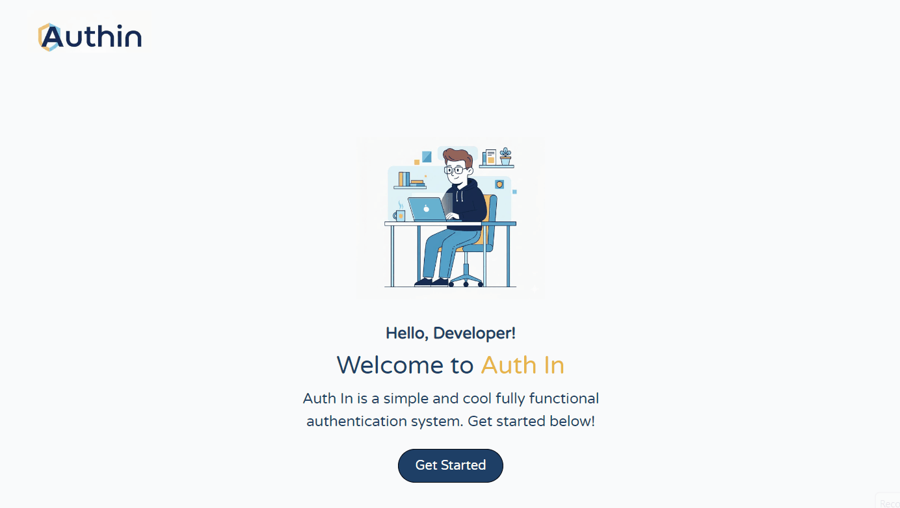

# Auth In

_A **cool** full-stack authentication system built with **MERN** stack._

**Auth In** is a production-ready authentication boilerplate designed to simplify secure user management.  
It features JWT-based authentication system + google authentication, protected routes, welcome + reset password emails, and a clean UI.

---

## Tech Stack

- **Frontend:** React, Vite, Tailwind CSS, Context API, React Router Dom, Axios
- **Backend:** Node.js, Express.js, MongoDB, Mongoose, Cors, Nodemailer & Brevo
- **Authentication:** JWT, bcrypt, cookie-parser
- **Development Tools:** Nodemon, Dotenv, express-async-handler

---

## Installation

1. Clone the repository

```bash
git clone https://github.com/baraa-elhajj/auth-in.git
```

2. Open two different terminals for each of the `backend` and `frontend` projects and install dependencies:

```bash
npm install
```

or install both projects' dependencies in a single `root` terminal:

```bash
npm run install:all
```

3. Set up environment variables<br>
   Create a `.env` file for:

```bash
# Backend
PORT = 4000
FRONTEND_URL = "http://localhost:5173"
MONGODB_CONNECTION_STRING = your_mongodb_connection_string
JWT_SECRET = your_jwt_secret
NODE_ENV = "development"

SMTP_BREVO_USER = your_brevo_user
SMTP_BREVO_SECRET = your_brevo_secret
SMTP_BREVO_EMAIL = your_brevo_email

GOOGLE_CLIENT_ID = your_google_client_id
GOOGLE_CLIENT_SECRET = your_google_client_secret
```

```bash
# Frontend
VITE_API_URL = "http://localhost:4000/api"
VITE_GOOGLE_CLIENT_ID = your_google_client_id
```

4. Run

```bash
# Backend
npm run server
```

```bash
# Frontend
npm run dev
```

or run both concurrently in the `root` terminal:

```bash
# root
npm run dev
```

---

## Preview



## Contribution

Love this project? **Drop** a star ⭐ and feel free to **fork** it or **suggest improvements** if you find something cool!
